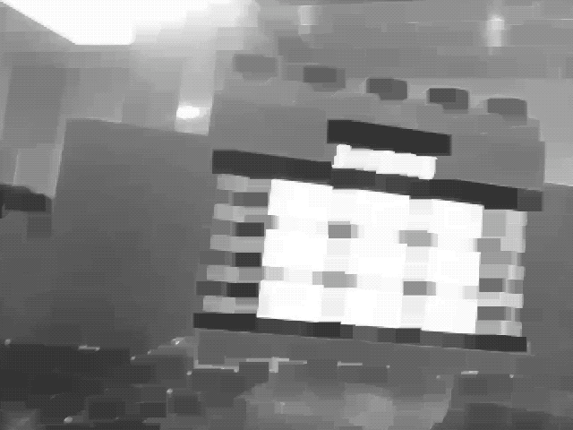
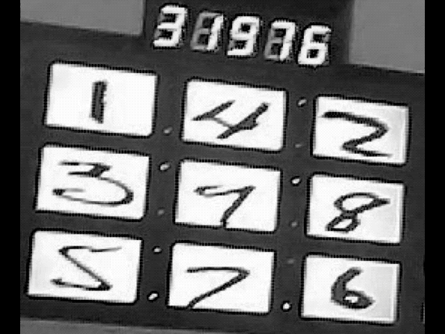
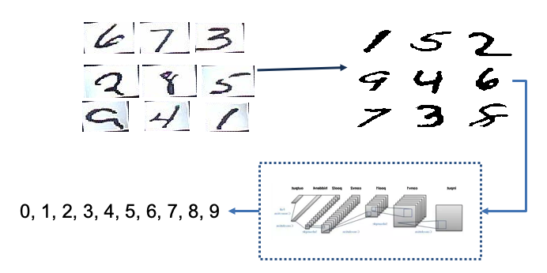
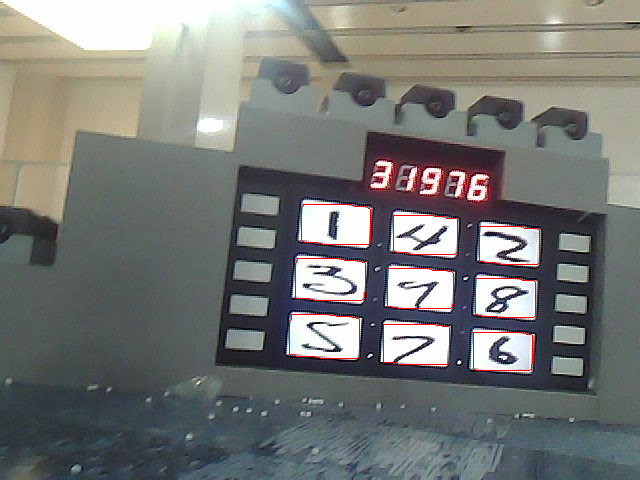
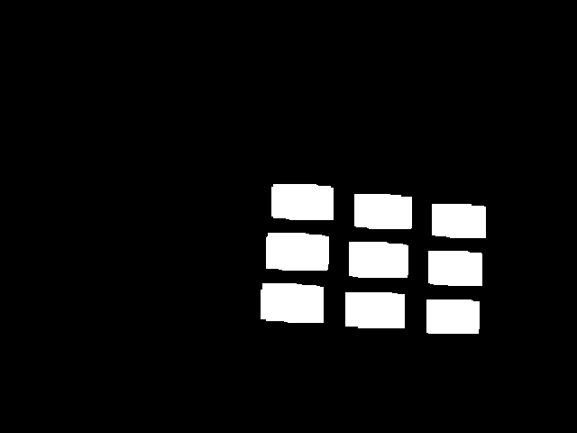
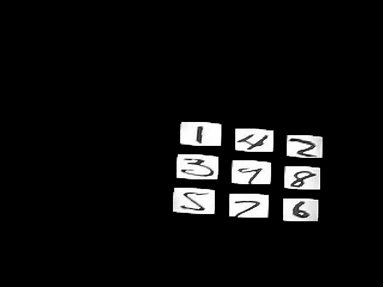
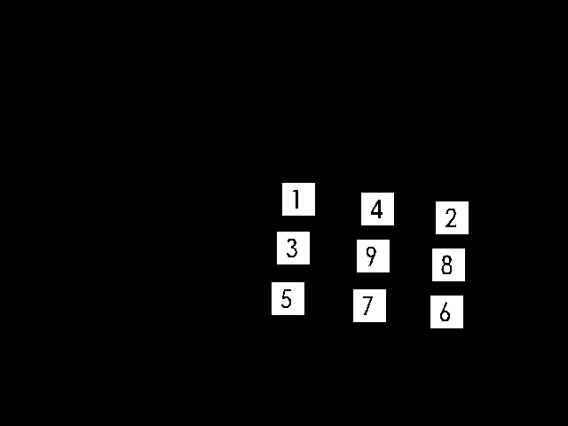

# "Power Runes" Recognition

- Author: LIN JIANING
- Date: 2018.5
- Course: Image Processing
- Hardware: MacBook Pro 
- Language: Matlab
- IDE: Matlab
- Description: In this project, I finished a program that can recognize hand-writing characters in a real environment, and this project derived from Robomaster 2018 Robotics Competition.

## USAGE

1. **put** test data in folder `./Code/test/`
2. **add** the `./Code` and its `subfolder` to the **matlab path**
3. **run** main.m

## RESULT

### Pre-process

|       Rough Process to find ROI       | Accurate Process to locate characters |
| :-----------------------------------: | :-----------------------------------: |
|  |      |

### Recognition

### Final Result

|                          |                      |
| ------------------------------------- | --------------------------------- |
|                |                    |
